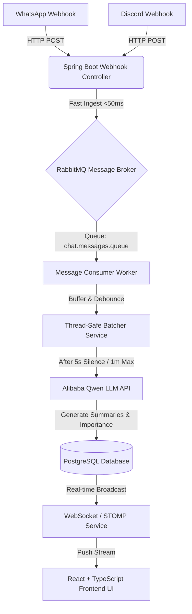

# Little Boy's Tardis - System Architecture

Welcome to the engineering and architectural profile of **Little Boy's Tardis**, the team behind **Tardis**. This document outlines our team roles, development values, and the end-to-end technical system architecture of the Tardis platform.

### Hackathon Metadata
* **Hackathon Submission**: [Tardis on Devpost](https://devpost.com/software/tardis-cypz4k)
* **Hackathon Event**: [Agentic AI Build Week 2026](https://agentic-ai-build-week-2026.devpost.com/resources)
* **Live Demo**: [tardis-hazel.vercel.app](https://tardis-hazel.vercel.app/)

--- ## Our Mission
Our mission is to bridge the communication gap between event organizers (Judges) and developers. By building asynchronous, event-driven architectures combined with state-of-the-art Large Language Models (LLMs), we transform chaotic announcements into structured, real-time actionable intelligence.

--- ## Team Roles & Responsibilities

During this hackathon, our team members took on specific, overlapping roles to ensure a high-quality end-to-end product:

| Name | Devpost | Role | Key Contributions in Tardis |
| :--- | :--- | :--- | :--- |
| **h1eudayne** | [@h1eudayne](https://devpost.com/h1eudayne) | Lead Backend Engineer | Developed Spring Boot webhook controllers, REST APIs, and verify-token security validation. |
| **hahoangbach2005** | [@hahoangbach2005](https://devpost.com/hahoangbach2005) | Frontend Developer | Created React + TSX client dashboard layouts, CSS styles, and responsive UI containers. |
| **teikv** | [@teikv](https://devpost.com/teikv) | AI & Queue Architect | Configured RabbitMQ exchanges/queues, background consumers, and Qwen-Turbo LLM API client. |
| **mickeytran2111** | [@mickeytran2111](https://devpost.com/mickeytran2111) | Full-Stack & DevOps Lead | Implemented WebSocket STOMP streaming, Docker Compose, and historical message logging. |

--- ## System Architecture & Data Flow

Tardis is architected for asynchronous resilience, separation of concerns, and fast response times. Webhook requests are acknowledged immediately (<50ms), queued safely, and processed out-of-band by background workers.



### 1. Ingestion Pipeline
* **Endpoints**: HTTP POST endpoints `/api/v1/webhooks/discord` and `/api/v1/webhooks/whatsapp` receive raw payload structures.
* **Authentication**: Each request is checked for a valid `X-Webhook-Token` header.
* **Fast Response**: The controller publishes the message to the RabbitMQ exchange and returns `200 OK` in <50ms, ensuring that client/webhook timeouts are avoided.

### 2. Message Queueing (RabbitMQ)
* **Exchange**: `chat.messages.exchange` (direct type) routing messages using `chat.message.routingKey`.
* **Queue**: `chat.messages.queue` stores ingested webhooks reliably.
* **Reliability**: Provides safety against spikes in traffic during announcement rushes.

### 3. Thread-Safe Debounce Batcher
* **Problem**: Judges often post multiple short messages sequentially to explain an issue (fragmented announcement burst).
* **Solution**: The consumer pushes messages into a thread-safe `ChatBatcherService` which maintains active buckets per conversation.
* **Logic**: It batches messages from the same channel until a **5-second silence window** is met (debounce) or a **1-minute maximum limit** is reached. This drastically reduces LLM tokens and consolidates context.

### 4. AI Processing & Summarization
* **API Model**: `qwen-turbo` (Alibaba DashScope OpenAI-compatible interface).
* **Prompting**: Instructs the model to extract actionable bullet points, identify keywords as tags, and categorize importance level (`HIGH`, `MEDIUM`, `LOW`).
* **Fallback**: If the LLM service is offline, a local fallback text extractor executes automatically to ensure zero system downtime.

### 5. Broadcasting & Persistence
* **PostgreSQL**: Saves the original message array, the final AI summary list, importance level, and tags.
* **WebSocket Broadcaster**: Sends a STOMP message to `/topic/announcements`. The React app subscribes to this topic and appends the card live with rich animations.

--- ## Technology Stack Detail

| Category | Technology | Detail / Purpose |
| :--- | :--- | :--- |
| **Backend Core** | Spring Boot 3.x, Java 21 | High performance REST, DI, and thread pools |
| **Message Broker** | RabbitMQ | Reliability, durability, and async decoupling |
| **Database** | PostgreSQL / H2 | Relational persistent store (PostgreSQL) / Memory test DB (H2) |
| **Realtime Stream** | WebSockets (STOMP Protocol) | Lightweight live updates pushing |
| **LLM Engine** | Qwen-Turbo (Alibaba DashScope) | Text analytics, bullet extraction, tagging, classification |
| **Frontend** | React 18, Vite, TypeScript | SPA framework, strict type definitions, speed |
| **Icons & Style** | Lucide React, CSS variables | Dashboard aesthetics, dark mode design system |

--- ## Codebase Directory Structure

```bash
Tardis/
 .github/                  # GitHub specific metadata
    README.md             # Systems architecture & Team profile
 backend/                  # Spring Boot backend source files
    src/                  # Main & test source packages
    pom.xml               # Maven configuration
    README.md             # Backend tech notes
 frontend/                 # React SPA source files
    src/                  # Components, styles, assets
    package.json          # Node configuration
    README.md             # Frontend tech notes
 docker-compose.yml        # Multi-container orchestration (Postgres, RabbitMQ)
 test_scenarios.md         # Simulated API payload definitions
 README.md                 # Main user guide & test manual
```
